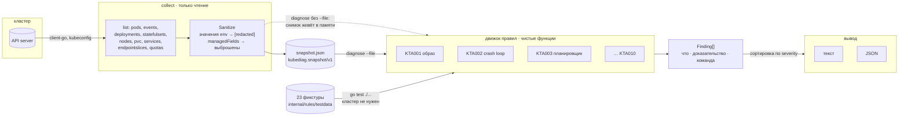

# k8s-troubleshoot-agent

CLI на Go, который читает состояние кластера Kubernetes (только на чтение) или
снимок этого состояния из файла и объясняет обычными словами, почему нагрузка
не работает: что сломано, на каких именно полях и событиях этот вывод основан и
какую команду выполнить следующей.

Это не обёртка над языковой моделью. Это движок правил поверх состояния
кластера: одинаковый ввод всегда даёт одинаковый вывод, и ничего не покидает
машину.

---

## Задача

`kubectl get pods` показывает `CrashLoopBackOff`. Это слово не является
диагнозом — оно означает только то, что kubelet начал делать паузы между
перезапусками. Настоящий сигнал лежит уровнем ниже, и три совершенно разных
инцидента выглядят снаружи одинаково:

| Что видно | Что произошло на самом деле | Кто это чинит |
|---|---|---|
| `CrashLoopBackOff` | `exitCode: 137`, `reason: OOMKilled` — ядро убило процесс за превышение лимита памяти | тот, кто владеет `resources.limits` |
| `CrashLoopBackOff` | `exitCode: 137` без `OOMKilled` — SIGKILL прислал liveness-пробник, срок которого короче реального старта приложения | тот, кто владеет пробниками |
| `CrashLoopBackOff` | `exitCode: 1` — приложение само дошло до своей ветки ошибки | автор приложения |

То же самое с `ImagePullBackOff`: неверный тег, отсутствующий pull-секрет и
троттлинг Docker Hub дают один и тот же статус, но общего между ними нет
ничего. С `Pending` хуже — планировщик пишет точную причину, но упаковывает
несколько независимых блокировок в одно предложение вида
`0/4 nodes are available: 1 node(s) had untolerated taint {...}, 3 Insufficient cpu`,
и читателю приходится восстанавливать, что именно мешает **его** поду.

Разбор этого — механическая работа. Она каждый раз одна и та же, её делают
руками в три часа ночи, и делают неодинаково: инженер, который знает про
`lastState.terminated`, справляется за минуту, а тот, кто не знает, полчаса
смотрит на слово `BackOff`.

`kubediag` кодирует этот разбор. Каждая находка состоит из трёх частей:
**что сломано**, **доказательство** (конкретное поле, условие или событие,
процитированное дословно) и **следующая команда**. Без доказательства находка
не публикуется — это проверяется движком и тестом.

---

## Архитектура



Ключевая деталь схемы: **правила не знают, откуда пришёл снимок.** У них нет
доступа ни к сети, ни к часам, ни к файловой системе — только к структуре
`Snapshot`. Живой кластер, файл недельной давности и фикстура из тестов для них
неразличимы, и это одно свойство даёт и офлайновую тестируемость, и возможность
разобрать чужой кластер по присланному файлу.

Часы стоит отметить отдельно. Возраст объекта считается не от `time.Now()`, а
от `snapshot.capturedAt`:

```go
func (s *Snapshot) Age(t *metav1.Time) time.Duration
```

Правило, которое дёрнуло бы `time.Now()`, давало бы на одной и той же фикстуре
разный ответ каждый день. Всё, что зависит от «как давно», проходит через этот
метод.

---

## Решения и компромиссы

### Движок правил, а не языковая модель

Задача выглядит идеальной для LLM: на входе полуструктурированный текст, на
выходе объяснение. Взял правила по четырём причинам, и первые две — про
доверие, а не про качество ответа.

**Детерминизм.** Инструмент диагностики читают в состоянии, когда уже что-то
горит. Ответ, который меняется от запуска к запуску на одном и том же вводе,
там бесполезен: невозможно сказать «у меня было по-другому час назад» и
получить объяснение. Тест `TestRunIsDeterministic` гоняет каждую из 23 фикстур
девять раз и сверяет результат побайтово.

**Данные не уезжают.** Спецификация пода регулярно содержит адреса внутренних
сервисов, имена неймспейсов, топологию узлов, а в литеральных `env` — пароли.
Отправлять это во внешний API ради фразы «похоже, у вас OOM» — плохой обмен.
`kubediag` не делает ни одного сетевого запроса, кроме обращения к самому
kube-apiserver.

**Объяснимость как контракт.** Правило не может утверждать что-то, не
предъявив поле, откуда это взято. Это не соглашение, а инвариант: движок молча
отбрасывает находку без доказательств, а `TestEveryFindingCitesEvidence`
проверяет на всех фикстурах, что каждое доказательство имеет непустой источник.
Модель так не умеет — она может процитировать поле, а может его выдумать, и
отличить одно от другого читатель не сможет.

**Цена и латентность.** 70 мс и ноль рублей за запуск против секунд и оплаты
токенов.

Где правила объективно проигрывают — и это не риторическая уступка: LLM лучше
на **незнакомом** отказе. Правило, которого нет, молчит; модель хотя бы
попробует. Поэтому вывод при чистом прогоне сформулирован так:

```
No findings. Every rule ran and none matched.
This means nothing the rules cover is broken — it is not a statement that the
cluster is healthy. Rules cover: see `kubediag rules`.
```

Это единственная формулировка в проекте, на которую есть отдельный тест
(`TestWriteTextOnACleanRunSaysWhatCleanMeans`), потому что «нет находок»,
прочитанное как «кластер здоров», — самый вредный способ понять этот инструмент
неправильно.

Разумное развитие — LLM **после** движка: правила собирают факты и цитаты,
модель пересказывает их для того, кто не знает Kubernetes. Порядок важен:
факты остаются проверяемыми, модель не является их источником.

### Снимок — главное решение всей архитектуры

`collect` пишет состояние кластера в один JSON, `diagnose` работает либо по
файлу, либо по живому кластеру. Это выглядит как удобная мелочь, а на деле
определяет три вещи сразу.

**Тесты без кластера.** Правила — чистые функции от `*Snapshot`. Весь набор
тестов (`go test ./...`) идёт 4 секунды, не требует ни Docker, ни kind, ни
сети, и в CI это обычная джоба на `ubuntu-24.04` без сервисов. Альтернатива —
envtest или kind в CI — стоила бы минут на прогон и принесла бы флейки в
проверку логики, которая к кластеру отношения не имеет.

**Разбор чужого кластера.** Коллега присылает файл — вы отвечаете диагнозом, не
имея доступа к его контуру. Ровно поэтому `collect` по умолчанию затирает
литеральные значения `env`:

```
"env": [
  {"name": "DATABASE_PASSWORD", "value": "[redacted by kubediag]"},
  {"name": "API_KEY", "valueFrom": {"secretKeyRef": {"name": "creds", "key": "api-key"}}}
]
```

Затираются **все** значения, а не «похожие на секреты»: эвристика «это выглядит
как пароль» ошибается ровно в тот раз, когда цена ошибки максимальна. Имя
переменной и ссылка `valueFrom` сохраняются — они диагностически полезны и
секрета не содержат. Отключается флагом `--keep-env-values`, который надо
набрать осознанно. Сами Secret и ConfigMap не собираются вообще: правилам нужно
знать только, существует ли объект, а на этот вопрос отвечает событие
`FailedMount` от kubelet.

**Диффы во времени.** Снимок до инцидента и снимок во время — это `diff`,
который показывает, что изменилось. Поэтому JSON пишется с отступами: файл
предназначен для чтения человеком и для ревью, а экономия байтов здесь ничего
не стоит.

Цена решения названа честно:

- **Снимок устаревает мгновенно.** Он не заменяет `kubectl get -w`. Все выводы
  относятся к моменту `capturedAt`, и это поле выведено в шапке отчёта.
- **Размер.** Кластер на несколько сотен подов даёт мегабайты. Смягчено:
  `managedFields` и аннотация `last-applied-configuration` (обычно больше
  половины объёма) вырезаются, список образов на узлах — тоже, каждый `list`
  ограничен 2000 объектами.
- **Формат придётся версионировать.** Поле `format` проверяется при загрузке, и
  чужой файл отклоняется с ошибкой. Снимок, молча прочитанный новым набором
  правил не так, дал бы уверенно неверный диагноз — это хуже отказа.

### Только чтение, и что именно это отнимает

Ни одного вызова на запись, никакого `exec`, никакого `kubectl debug`. Инструмент
должен быть безопасен для прода в руках человека, у которого уже плохой день, и
надёжнее всего это обеспечивается отсутствием кода, который может что-то
изменить. Достаточно любой роли с `get`/`list` — а частичный отказ в правах не
прерывает сбор:

```
warning: list nodes: nodes is forbidden: ... (the current context lacks read access
to this kind; the snapshot will be incomplete and rules over this kind will stay silent)
```

Разработчик с правами на один неймспейс получает рабочий снимок, а не пустой
экран. Число собранных объектов каждого вида печатается в строке `scanned:`,
чтобы «правила ничего не нашли» нельзя было спутать с «правилам не на что было
смотреть».

**Чего это стоит — логов приложения.** Это самая большая потеря, и подмены ей
нет. `kubediag` уверенно скажет «контейнер выходит с кодом 1, это ошибка на
стороне приложения», но не скажет, какая именно, потому что ответ находится в
`kubectl logs --previous`. Такая команда стоит первой в списке следующих шагов
для каждой находки о крешлупе.

Почему логи всё-таки не читаются: `pods/log` — отдельное право, которого у
многих читающих ролей нет; логи почти наверняка содержат персональные данные и
секреты, а значит снимок перестал бы быть пересылаемым; объём вырос бы на
порядки. Три причины против одной — граница проведена здесь.

### Как не сработать на поде, который просто ещё стартует

Самая частая причина, по которой такие инструменты выключают, — они кричат во
время нормального деплоя. Решение — окно `StartupGrace = 30s`, и число не
взято с потолка: базовая задержка backoff у kubelet равна 10 секундам и
удваивается, так что раньше примерно получаса «перезапускается» и «стартует» —
одно и то же наблюдение.

Окно применяется не везде, и разница принципиальна:

| Правило | Ждёт grace? | Почему |
|---|---|---|
| KTA002 crash loop | да, если `restartCount ≤ 1` | один перезапуск в первые секунды — это старт, а не цикл |
| KTA006 readiness | да, всегда | у пробника есть `initialDelaySeconds`; сработать раньше — значит подсветить каждый под при каждом раскате |
| KTA007 нет endpoints | да, по возрасту Service и подов | у свежего Deployment законно нет готовых endpoints |
| KTA010 Deployment | да, по возрасту объекта | раскат в процессе — это не отказ |
| KTA001 образа нет в реестре | **нет** | состояние терминальное: ждать дольше ответ не изменит |
| KTA003 untolerated taint | **нет** | планировщик уже сказал «нигде»; время не поможет |

Отдельно отсекаются классы объектов, о которых говорить не нужно вовсе: поды в
`Succeeded`, упавшие поды под управлением `Job` (это дело Job, а не наше), и всё
с `deletionTimestamp` — если объект удаляют, значит этого хотели.

Контроль этой части вынесен в фикстуры, которые обязаны не дать **ни одной**
находки: `healthy.json`, `rollout-in-progress.json` (Deployment возрастом 18
секунд, поды поднимаются, PVC ещё не привязан), `completed-jobs.json`,
`terminating.json`. Одна из них уже поймала настоящий дефект: Service, все поды
которого удаляются, выдавал критическую находку — теперь такие поды исключаются
из подсчёта.

### Доказательство обязательно, «оценки здоровья» нет

У находки нет числового скора, и это осознанно. Скор — это способ смешать
несопоставимое в одно число, которое затем никто не может объяснить. Вместо
него три уровня с определениями, которые можно применить, не заглядывая в код:

- **critical** — не обслуживает и само не починится;
- **warning** — обслуживает, но запаса нет;
- **info** — контекст, объясняющий другое (например, закордоненный узел).

Сортировка полная и детерминированная: severity, затем неймспейс, имя объекта,
контейнер, идентификатор правила. Текстовый отчёт диффают между прогонами, и
переезжающие строки сделали бы дифф бесполезным.

Из того же соображения в тексте нет ANSI-цвета и рамок: этот вывод чаще
вставляют в тикет и в чат, чем разглядывают в терминале, а escape-последо­ва­тель­но­сти
не переживают ни того, ни другого. Метка вида доказательства — фиксированной
ширины (`[event]`, `[cond] `, `[field]`), чтобы столбец не ехал и по нему
работал `grep`.

Времена печатаются в UTC — тоже не косметика. `metav1.Time.UnmarshalJSON`
переводит время в локальную зону, и без нормализации один и тот же файл давал
бы разные строки в Ереване и в Лондоне. Зафиксировано тестом
`TestFormatTimeIsAlwaysUTC`.

### EndpointSlice, а не Endpoints

Правило про Service читает `discovery.k8s.io/v1 EndpointSlice`. Объект
`Endpoints` проще и до сих пор существует, но он объявлен устаревшим, а на
крупных сервисах ещё и обрезается: все адреса складываются в один объект,
который упирается в лимит etcd. Разница в коде — примерно десять строк, разница
в правильности на большом кластере — принципиальная.

Полезный побочный эффект: у `EndpointSlice` есть отдельные условия `ready`,
`serving` и `terminating`, поэтому «endpoints есть, но ни один не готов» и
«селектор не нашёл ни одного пода» различаются точно, а не по косвенным
признакам. Это ровно те два случая, которые требуют разных действий: первый —
проблема подов, второй — опечатка в лейблах.

### Что сознательно не покрывается

Список правил — это честная граница инструмента, поэтому команда
`kubediag rules` печатает его целиком. Не покрыто:

- **Сетевая связность между подами, DNS, NetworkPolicy.** Проверяются только
  выполнением запросов изнутри кластера. Это уже не диагностика по состоянию, а
  активная проба: нужен под, нужны права на его создание, нужно право на
  `exec`. Всё это ломает и модель «только чтение», и офлайновый разбор снимка.
- **Ingress и внешний трафик.** Ответ распределён между контроллером Ingress,
  внешним балансировщиком и DNS, из которых в API-сервере видна только треть.
  Правило, судящее по трети, будет уверенно ошибаться.
- **Проблемы уровня приложения.** Медленные запросы, утечки, ошибки логики. Их
  нет в состоянии кластера, они в метриках и логах.
- **CRD и операторы.** Здоровье `Application` из Argo CD или кластера Postgres
  из оператора описывается схемой, специфичной для каждого CRD. Общего правила
  для них не существует; это точка расширения, а не пробел.
- **RBAC и admission-вебхуки в общем виде.** Частный случай — отказ по квоте —
  покрыт (KTA008), потому что у него есть характерный след в
  `status.used`. Отказ вебхука в общем случае виден только в событии
  `FailedCreate`, и осмысленно интерпретировать чужой вебхук нельзя.

### Прочие решения, короче

- **Один статически слинкованный бинарь, не оператор в кластере.** Инструмент
  нужен именно тогда, когда с кластером плохо, — а это худший момент, чтобы
  зависеть от того, что в нём что-то запущено.
- **cobra и клон флагов kubectl.** `--kubeconfig`, `--context`, `-n` называются
  и ведут себя как у kubectl: свой словарь флагов — это лишняя вещь, которую
  надо вспоминать под давлением. Бонусом бинарь, переименованный в
  `kubectl-diag` и положенный в `PATH`, работает как `kubectl diag`.
- **Код выхода 2, а не 1, при находках.** `--fail-on critical` предназначен для
  CI, и там нужно различать «кластер нездоров» (2) и «сам инструмент сломался»
  (1). По умолчанию `--fail-on none`: в интерактивном разборе ненулевой код
  только мешает.
- **Опечатка в `--rule` — ошибка, а не пустой прогон.** `--rule KTA00l` иначе
  запустил бы ноль правил и отрапортовал здоровый кластер. Худший из возможных
  видов молчания.
- **`--namespace` к готовому снимку не применяется.** Сужать уже собранный файл
  значило бы выбросить часть находок и выдать остаток за полный отчёт. Команда
  отказывается и объясняет, что нужно перезапустить `collect`.
- **Правила, спорящие об одном контейнере, уступают друг другу.** Контейнер в
  крешлупе не готов — но находку выдаёт только KTA002: KTA006 про него молчит,
  потому что причина уже объяснена подробнее. Проверено в фикстурах через
  список `mustNotFire`.
- **Бинарь весит 43 МБ.** Это цена `client-go`: пакет тянет схемы всех типов
  API. Собственный HTTP-клиент к API-серверу дал бы мегабайты вместо десятков,
  но потребовал бы своей реализации разбора kubeconfig, аутентификации
  (exec-плагины, OIDC, облачные провайдеры) и типов — то есть повторения
  `client-go` худшего качества. Обмен принят осознанно.

---

## Правила

```console
$ kubediag rules
KTA001  image cannot be pulled: wrong reference, missing credentials, throttling or unreachable registry
KTA002  container restarts repeatedly: OOM kill, signal, or non-zero application exit
KTA003  pod stays Pending: insufficient resources, taints, node selector or unbound volume
KTA004  pod stuck creating: a Secret, ConfigMap or volume it mounts cannot be attached
KTA005  PersistentVolumeClaim stays Pending: no provisioner, no matching volume, or an unknown class
KTA006  container runs but fails its readiness probe, so it is kept out of Service endpoints
KTA007  Service has no ready endpoints: selector matches nothing, or matching pods are not ready
KTA008  ResourceQuota is exhausted, so new pods in the namespace are rejected at admission
KTA009  node is NotReady, under disk or memory pressure, or cordoned
KTA010  Deployment or StatefulSet has fewer available replicas than desired
```

Внутри правила различают подслучаи, потому что чинятся они по-разному:

| Правило | Различает |
|---|---|
| KTA001 | нет такого тега · отказ в правах реестра (и есть ли вообще `imagePullSecrets`) · rate limit 429 · реестр недоступен по сети · невалидная ссылка на образ |
| KTA002 | `OOMKilled` (и указан ли лимит) · 137 без OOM · 143 SIGTERM · 139 SIGSEGV · 127 команда не найдена · 126 не исполняется · 0 при `restartPolicy: Always` · произвольный код приложения |
| KTA003 | не хватает CPU/памяти · taint без toleration · nodeSelector · непривязанный PVC · конфликт зональности тома · anti-affinity — **и все сразу**, если планировщик назвал несколько |
| KTA004 | нет Secret · нет ConfigMap · таймаут подключения тома · Multi-Attach · сбой CNI при создании sandbox |
| KTA005 | неизвестный StorageClass · `WaitForFirstConsumer` (это не отказ, severity `info`) · нет подходящего PV |
| KTA006 | connection refused (никто не слушает порт) · таймаут (порт открыт, обработчик медленный) · код ответа |
| KTA007 | селектор не нашёл подов · поды есть, но не готовы · `targetPort`, которого нет ни в одном контейнере |
| KTA009 | `Ready: Unknown` (kubelet замолчал — это сеть) против `Ready: False` (kubelet жалуется сам) · disk/memory/PID pressure · cordon |

---

## Метрики

Все числа получены запуском на этом репозитории; команды приведены рядом.

| Показатель | Значение | Как получено |
|---|---|---|
| Правил | 10 | `kubediag rules` |
| Фикстур-снимков | 23 (284 КБ) | `ls internal/rules/testdata/*.json` |
| Тестовых функций / случаев с подтестами | 56 / 133 | `go test -v ./...` |
| Покрытие | **82.3 %** | `make cover` |
| Прогон тестов | **≈ 4 с** суммарно по пакетам, без кластера и без сети | `go test -count=1 ./...` |
| `go test -race ./...` | проходит | — |
| `golangci-lint run ./...` | **0 issues** | v2.1.6, конфигурация в `.golangci.yml` |
| Один `diagnose` по снимку | **≈ 77 мс** (с запуском процесса) | 20 прогонов за 1.54 с |
| Строк кода / тестов | 4079 / 2115 | `wc -l` по `*.go` |
| Размер бинаря | 42.9 МБ (`-s -w -trimpath`) | `ls -l bin/kubediag` |

Покрытие считается с `-coverpkg=./cmd/...,./internal/...`: основная часть
`snapshot/` и `report/` проверяется тестами пакета `rules` через границу
пакетов, и без этого флага Go такую работу не засчитывает.

### Как устроены тесты

Тесты — основная часть этого репозитория, и устроены они так:

**Фикстуры проверяются на точное совпадение.** Для каждого снимка перечислен
полный набор ожидаемых находок парами «правило + объект». Любая находка, не
попавшая в список, роняет тест. Формулировка «хотя бы эти» позволила бы
ложным срабатываниям накапливаться незамеченными, а движок правил оценивается
ровно настолько же по тому, о чём он **молчит**.

**Контроль ложных срабатываний вынесен явно.** Кроме точного совпадения у
каждого случая есть список `mustNotFire` — правила, на которых неаккуратная
реализация споткнулась бы именно здесь. Формально он избыточен, содержательно —
это записанное намерение:

```go
{
    file: "node-notready.json",
    why:  "the kubelet went silent; pod status on that node is stale, not wrong",
    wantFindings: []want{{rule: "KTA009", subject: "node/diag-worker2", ...}},
    // Поды на мёртвом узле всё ещё отчитываются Running и Ready. Ни одно
    // правило про поды не имеет права придумать из этого отказ.
    mustNotFire: []string{"KTA002", "KTA006", "KTA007"},
},
```

**Находка проверяется не только фактом срабатывания.** Пиннится severity,
подстрока заголовка (KTA001 должно сказать именно «wrong tag», а не «no
credentials»), подстрока объяснения и наличие конкретного доказательства —
чтобы правило не могло пройти тест, сказав верное по неверной причине.

**Инварианты проверяются на всех фикстурах сразу:** каждая находка имеет
доказательство с непустым источником и непустое объяснение; severity известна;
порядок — от худшего; девять повторных прогонов дают идентичный результат.

**Ширина классификаторов покрыта табличными юнит-тестами.** Десять кодов выхода
и десять сообщений реестров разбираются отдельно, без фикстуры на каждый —
включая случаи вроде `localhost:5000/app`, на котором наивный поиск последнего
двоеточия отрезал бы порт вместо тега.

### Честно о фикстурах

Фикстуры **написаны вручную** по реальным формам объектов API, а не сняты с
работающего кластера. Изначальный план был другим: поднять `kind`, сломать
нагрузки намеренно (битый образ, заниженный лимит памяти, под без места,
падающий пробник) и снять настоящие снимки. От этого пришлось отказаться —
`kind` в окружении сборки не установлен, а образ данных Docker Desktop уже
занимает 40 ГБ на системном диске, где свободно 5.6 ГБ; выкачивание
`kindest/node` и запуск кластера с высокой вероятностью забили бы диск
полностью.

Что это значит на практике: сообщения kubelet, планировщика и реестров в
фикстурах воспроизведены по их реальным формулировкам, структура объектов
соответствует схемам `k8s.io/api` (файлы декодируются в те же типы `corev1.Pod`,
`corev1.Node` и так далее, так что расхождение в форме проявилось бы сразу),
но это реконструкция, а не запись. Снимок с настоящего кластера может
содержать поля, которых здесь нет, и формулировки, которые изменились между
версиями Kubernetes. Замена фикстур на снятые с `kind` — первое, что стоит
сделать в окружении, где для этого есть место; формат файлов при этом не
меняется, `collect` пишет ровно то, что читают тесты.

По той же причине не проверялся путь `collect` против живого API-сервера:
сборщик протестирован против `k8s.io/client-go/kubernetes/fake`, включая
частичный отказ в правах, но не против настоящего kube-apiserver.

---

## Запуск

Нужен только Go 1.23+. Кластер не нужен — в репозитории лежат снимки.

```sh
git clone https://github.com/lpogosu/k8s-troubleshoot-agent.git
cd k8s-troubleshoot-agent
make demo
```

`make demo` собирает бинарь и разбирает снимок кластера с несколькими
несвязанными отказами одновременно. Вывод целиком приведён ниже — это реальный
прогон, а не пример:

```console
$ kubediag diagnose -f internal/rules/testdata/mixed-incident.json
kubediag · kind-diag · all namespaces · captured 2026-07-16T09:41:22Z
scanned: 3 nodes, 4 pods, 1 deployments, 0 statefulsets, 1 services, 0 pvcs, 1 quotas, 4
events
findings: 6 critical, 2 warning

CRITICAL  node is not Ready
  node/diag-worker2 · KTA009

  The node has stopped reporting itself as healthy. The condition is Unknown rather than
  False, which specifically means the control plane stopped hearing from the kubelet
  altogether — the node may well be running fine and simply unable to reach the API
  server. Network, not workload. 1 pod(s) are scheduled here; after the eviction timeout
  the controller manager will start recreating the ones that belong to a controller, and
  any pod holding a ReadWriteOnce volume will block until its old attachment is
  released.

  evidence
    [cond]   status.conditions[type=Ready]
        Ready=Unknown reason=NodeStatusUnknown: Kubelet stopped posting node status.
    [field]  status.conditions[type=Ready].lastHeartbeatTime
        2026-07-16T09:34:30Z (6m52s before capture)
    [field]  pods scheduled on this node
        streaming/kafka-0

  next
    $ kubectl describe node diag-worker2
    $ kubectl get pods -A -o wide --field-selector spec.nodeName=diag-worker2

----------------------------------------------------------------------------------------

CRITICAL  container was OOM-killed
  payments/pod/ledger-5f8c7d6b9-4kq2n [app] · KTA002

  The kernel killed the container for exceeding its memory limit. This is not the
  application choosing to exit: the process was terminated mid-work with SIGKILL and
  could not clean up. The limit in force is 128Mi. Either the limit is below what the
  workload genuinely needs, or the workload is leaking; the restart interval tells you
  which, since a leak takes progressively the same time to hit the ceiling while an
  undersized limit is hit almost immediately. The pod is managed by
  ReplicaSet/ledger-5f8c7d6b9, so the fix belongs in that object's pod template.

  evidence
    [field]  status.containerStatuses[0].restartCount
        7
    [field]  status.containerStatuses[0].state.waiting
        reason=CrashLoopBackOff: back-off 5m0s restarting failed container=app
        pod=ledger-5f8c7d6b9-4kq2n_payments(uid-ledger-5f8c7d6b9-4kq2n)
    [field]  status.containerStatuses[0].lastState.terminated
        exitCode=137 reason=OOMKilled finishedAt=2026-07-16T09:40:34Z
    [event]  Event/ledger-5f8c7d6b9-4kq2n.185b2c1f9a4e1101 reason=BackOff from=kubelet (x23)  2026-07-16T09:41:13Z
        Back-off restarting failed container app in pod
        ledger-5f8c7d6b9-4kq2n_payments(uid-ledger-5f8c7d6b9-4kq2n)

  next
    $ kubectl -n payments logs ledger-5f8c7d6b9-4kq2n -c app --previous
    $ kubectl -n payments describe pod ledger-5f8c7d6b9-4kq2n
    $ kubectl -n payments get pod ledger-5f8c7d6b9-4kq2n -o jsonpath='{.spec.containers[?(@.name=="app")].resources}'
    $ kubectl top pod -n payments ledger-5f8c7d6b9-4kq2n --containers
```

Дальше в этом же выводе идут `Service has endpoints but none is ready`
(KTA007), `Deployment has not converged` с `ProgressDeadlineExceeded` (KTA010),
`container is running but never becomes ready` с диагнозом
`connection refused` (KTA006), `image reference does not exist in the registry`
(KTA001) и две находки уровня warning — `node is under memory pressure` и
`ResourceQuota search-quota is nearly exhausted`.

Порядок здесь и есть смысл сортировки: сверху лежит замолчавший узел, а не
превышенная на 95 % квота, потому что чинить надо в этом порядке.

### На своём кластере

```sh
kubediag diagnose                       # текущий контекст, все неймспейсы
kubediag diagnose -n payments           # один неймспейс
kubediag diagnose -o json | jq '.findings[] | select(.severity=="critical")'

kubediag collect -o cluster.json        # снять состояние (env затираются)
kubediag diagnose -f cluster.json       # разобрать снимок, в том числе чужой

kubediag diagnose --rule KTA002,KTA009  # только выбранные правила
kubediag diagnose --min-severity warning
kubediag diagnose --fail-on critical    # код выхода 2 при находках — для CI
```

Коды выхода: `0` — находок ниже порога `--fail-on`, `1` — ошибка самого
инструмента, `2` — есть находки уровня `--fail-on` и выше.

### Цели Makefile

| Цель | Что делает |
|---|---|
| `make demo` | сборка + разбор встроенного снимка инцидента |
| `make demo-json` | тот же прогон в JSON |
| `make rules` | список правил |
| `make build` | бинарь в `bin/kubediag` |
| `make test` | `go test -race ./...` |
| `make lint` | golangci-lint зафиксированной версии |
| `make cover` | итоговое покрытие |

---

## Что проверяет CI

`.github/workflows/ci.yml`, четыре джобы на `ubuntu-24.04`, без кластера:

- **lint** — `gofmt -l` (пустой вывод обязателен, потому что сам `gofmt` всегда
  возвращает 0) и `golangci-lint` версии v2.1.6;
- **test** — `go vet`, `go test -race`, отчёт о покрытии;
- **build** — кросс-сборка под linux/amd64, linux/arm64, darwin/arm64 и
  windows/amd64 с `CGO_ENABLED=0`;
- **smoke** — то, что зелёные юнит-тесты не проверяют: собранный бинарь
  запускается так, как его набирает пользователь. Проверяются `rules`,
  текстовый вывод, валидность JSON и оба кода выхода — что чистый снимок даёт
  `0` даже с `--fail-on critical`, а снимок с инцидентом даёт ровно `2`.

Экшены запинены по SHA.

---

## Структура

```
.
├── cmd/kubediag/main.go          # только трансляция ошибки в код выхода
├── internal/
│   ├── cli/                      # cobra: collect, diagnose, rules
│   ├── collect/
│   │   ├── collect.go            # client-go, только list; частичный отказ не фатален
│   │   └── sanitize.go           # затирание env, вырезание managedFields
│   ├── snapshot/
│   │   ├── snapshot.go           # формат, версия, Age() — единственные часы правил
│   │   └── lookup.go             # выборки: события объекта, поды по селектору, условия
│   ├── rules/
│   │   ├── engine.go             # интерфейс Rule, StartupGrace, отбраковка без доказательств
│   │   ├── finding.go            # Finding, Evidence, Severity, полный порядок сортировки
│   │   ├── pods.go               # общие фильтры: что вообще подлежит диагностике
│   │   ├── imagepull.go          # KTA001
│   │   ├── crashloop.go          # KTA002
│   │   ├── scheduling.go         # KTA003
│   │   ├── volumes.go            # KTA004, KTA005
│   │   ├── readiness.go          # KTA006
│   │   ├── service.go            # KTA007
│   │   ├── quota.go              # KTA008
│   │   ├── node.go               # KTA009
│   │   ├── rollout.go            # KTA010
│   │   └── testdata/             # 23 снимка: по случаю на подслучай + контроли
│   └── report/                   # текст (перенос по словам, без ANSI) и JSON
├── .golangci.yml
├── .github/workflows/ci.yml
└── Makefile
```

---

## Лицензия

MIT — см. [LICENSE](LICENSE).
